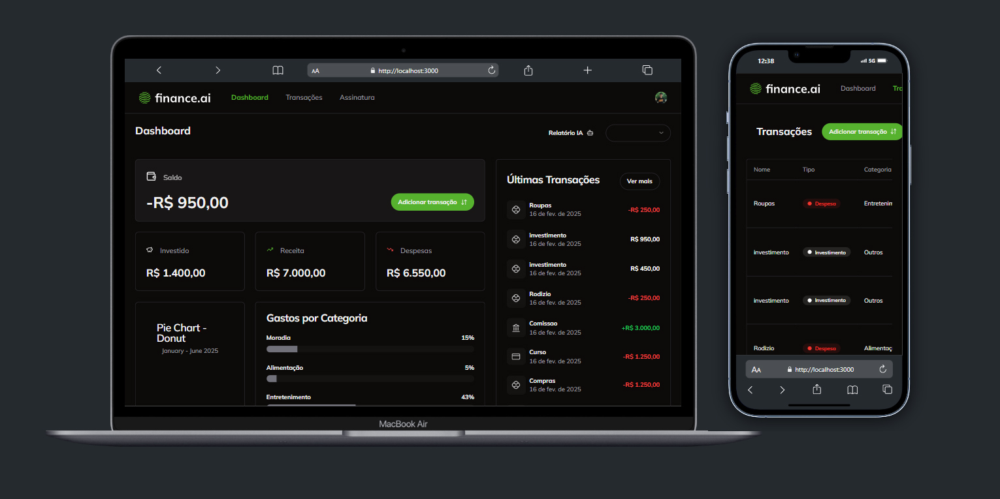

<h1 align="center">Finance.ai</h1>

> 🔎 Bem-vindo ao meu SaaS de finanças!
 
  
  
## :page_facing_up: Explicação
O Financas.ai é uma plataforma SaaS para gerenciamento financeiro integrada com a API do ChatGPT, permitindo gerar relatórios mensais detalhados sobre transações e finanças. A solução oferece um painel interativo que exibe um resumo financeiro do mês atual e permite selecionar outros meses para consulta. Além disso, possui uma página exclusiva para transações, onde é possível adicionar novas movimentações e visualizar todas as transações passadas.

## 📁 Seções da página

- Login: Tela de autenticação e cadastro utilizando Clerk, permitindo login com Google.
- Dashboard: Apresenta o relatório financeiro do mês atual, com opção de selecionar outros meses. Inclui gráficos interativos utilizando Shadcn.
- Transações: Exibe todas as transações financeiras, permitindo adicionar, editar e remover entradas.
- Assinatura: Página para upgrade do plano gratuito para o pago, oferecendo benefícios avançados, como relatórios aprimorados com IA. O pagamento é processado via Stripe.

## 🚀 Tecnologias Utilizadas

### 🎨 Design e Colaboração

- **Eraser.io** → Plataforma colaborativa para design e esboços online, ideal para brainstormings visuais em equipe.

### 🗄 Banco de Dados e ORM

- **Neon** → Banco de dados PostgreSQL na nuvem, otimizado para desenvolvimento moderno.
- **Prisma** → ORM para Node.js e TypeScript, facilitando a manipulação segura de dados em bancos de dados.
  - Migrações automáticas para manter o schema atualizado.
  - Otimização de queries SQL para SSR e SSG no Next.js.
  - Prisma Studio para gerenciamento visual de dados.

### 💻 Interface do Usuário

- **Next.js** → Framework React para renderização eficiente e otimizada.
- **Shadcn** → Biblioteca de componentes modernos para UI, com design minimalista e suporte a Tailwind CSS.
  - Acessibilidade integrada.
  - Suporte para modo escuro.
  - Componentes dinâmicos e interativos.

### 🔐 Autenticação

- **Clerk** → Serviço de autenticação e gestão de usuários, incluindo login com Google, controle de sessão e autenticação multifatorial.

### 💳 Plataforma de Pagamento

- **Stripe** → Plataforma de pagamento online para facilitar a compra de planos premium, garantindo segurança e suporte a pagamentos recorrentes.

### 🤖 Inteligência Artificial
- **ChatGPT** → Assistente de IA relatorios e dicas das finanças do mês.

## 🤝 Colaboradores

Agradecemos às seguintes pessoas que contribuíram para este projeto:

## 🤝 Colaboradores

<table>
  <tr>
    <td align="center">
      <a href="#">
         
        
          <b>Diogo Kimisima</b>
        
      </a>
    </td>
  </tr>
</table>

## 📝 Licença

Este projeto está sob licença. Consulte o arquivo <a href="https://github.com/diogokimisima/diogoKimisima/blob/main/LICENSE">LICENSE</a> para obter mais detalhes.

<a href="#top">Volte para o topo</a>
